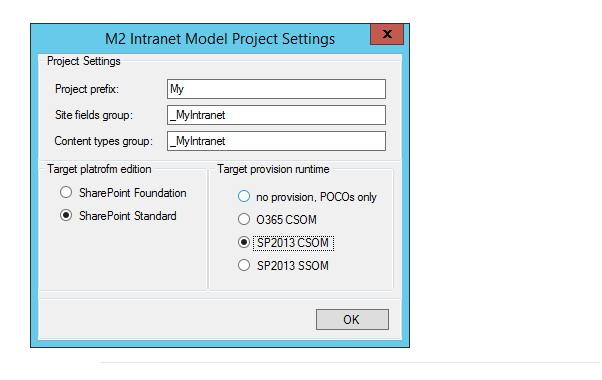

## SPMeta2 Extensions for Visual Studio
[SPMeta2 Extensions for Visual Studio]("https://github.com/SubPointSolutions/spmeta2-vsixextensions") adds a bunch of useful snippets, project and item templates to Visual Studio. The purpose is to make your daily M2/SharePoint related work in Visual Studio much easier and more productive, while also bringing consistency across your projects, people and teams.

### The story and experience
Whether you are building a proof-of-concept, a corporate intranet or a six-figures project on top of SharePoint platform, 
[SPMeta2/M2]("https://github.com/SubPointSolutions/spmeta2") is all you need to deploy SharePoint artefacts in an enjoyable, smooth, testable and repeatable way. [SPMeta2]("https://github.com/SubPointSolutions/spmeta2") is a .NET library that offers a  hassle-free fluent API supporting SharePoint 2010, 2013 and O365 over both CSOM and SSOM. It is the first building block to well-structured and consistent projects.

We learnt a lot while providing SPMeta2 support to independent consultants, small start-ups, ISVs, SharePoint consultancy companies as well as large enterprises with six-figures projects across the globe. Consequently, a well-structured approach to create, develop, maintain and support SPMeta2 project was born. Later on, it was encapsulated into Visual Studio snippets and project templates, so that other people can have the same positive and enjoyable experience not only starting projects from scratch, but also supporting and enhancing already existing ones. This is our second building block to well-structured and consistent projects.

In nutshell, there are a few project templates to help get your SharePoint project started in just a few clicks:

Then we ask if you want to include provision and desired SharePoint runtime, or go POCO, deciding on provision later:

And then you're done! Up and running:

Curious? Get started with the documentation and let us know what you think.
### Documentation 
There are a bunch of snippets, a few project templates and a debugger visualizer that significantly enhance development routines. Once you've learned SPMeta2's new way of doing things we bet your love for SharePoint will be rekindled.

Please consider the following links to get familiar with the general concepts, project templates, snippets and creating new projects.

* [General Concepts](/SPMeta2-VS/getting-started)
* [M2 Intranet Model project](/SPMeta2-VS/getting-started/IntranetModelProjectTemplate)
* [M2 Console Provision project](/SPMeta2-VS/getting-started/ConsoleProvisionProjectTemplate)
* [M2 Snippets](/SPMeta2-VS/getting-started/Snippets)

### Contribution
We're keen to hear back from the community improving both [SPMeta2](https://github.com/SubPointSolutions/spmeta2) and [SPMeta2 Extensions for Visual Studio](https://github.com/SubPointSolutions/spmeta2-vsixextensions). Whenever you like or dislike something, give us a shot so that we can fix that:
* Join [SPMeta2 Yammer Network](https://www.yammer.com/spmeta2feedback)
* Suggest something at [SPMeta2 UserVoice](https://subpointsolutions.uservoice.com)
* Get your hand dirty and pull to [SPMeta2](https://github.com/SubPointSolutions/spmeta2) or [SPMeta2 Extensions for Visual Studio](https://github.com/SubPointSolutions/spmeta2-vsixextensions) repos
* Give a few hint via github issues
* Follow us @ [twitter](https://twitter.com/spmeta2) :)