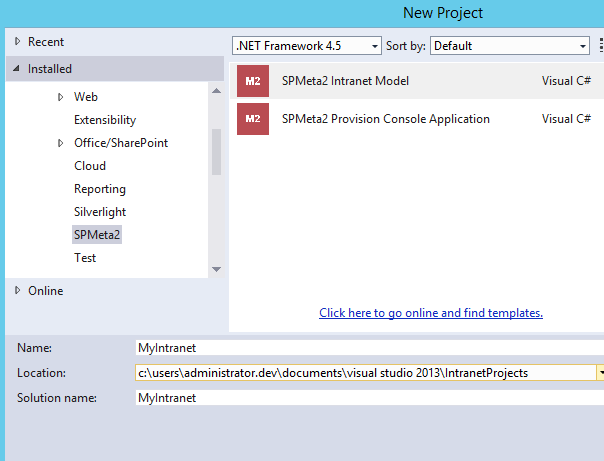
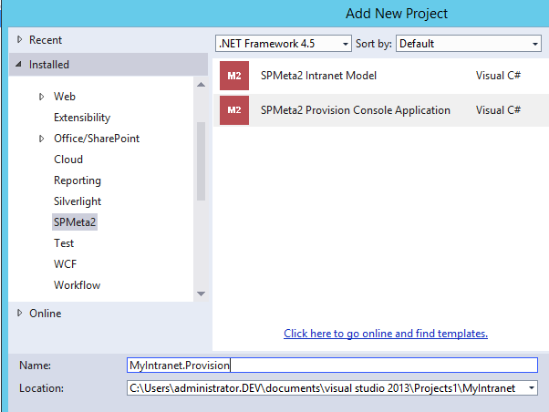
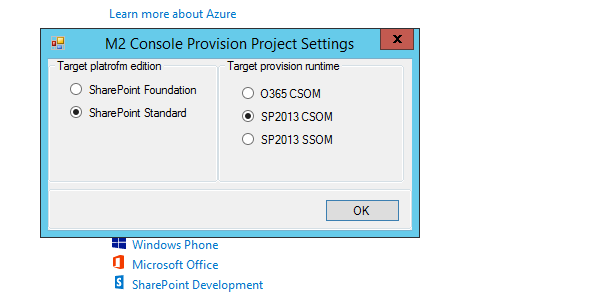
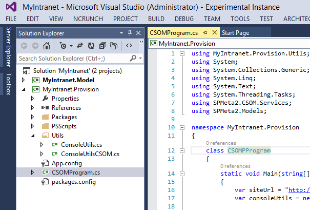
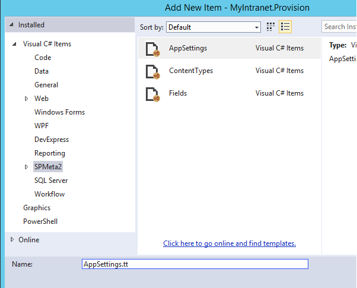
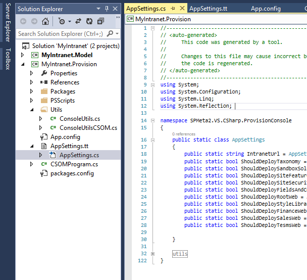
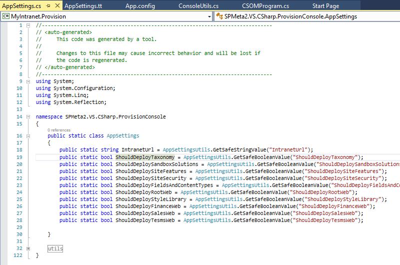

---
Title: Console App Provision Project Template
Order: 400
TileLink: true
TileLinkOrder: 40
---
## Getting started with M2 VS Console provision project

The current document describes general concepts, guidelines and recommendation on building SharePoint solutions with the SPMeta2 library. It is crafted based on both SPMeta Dev team experience on building M2 library, supporting companies all over the world and client's feedback as such. Hence, it should be considered not only as a jump start guide but also as a production ready approach on building M2 solutions.

The target audience is .NET developers, team leads and software architects who are familiar with POCOs, fluent API, DSL, CI/ALM and seeking guides on he following areas:

* Overview of SPMeta2 project templates
* SPMeta2 Intranet Model project template
* SPMeta2 Provision Console project template
* Snippets

Altogether the document provides a high-level overview of building highly scalable, repeatable and easy-to-maintain projects on top of SPMeta2 library for SharePoint 2013 and O365 using both CSOM/SSOM.

Before continue, please get familiar with the following [General concepts](https://github.com/SubPointSolutions/spmeta2-vsixextensions/wiki/General-concepts), so that it would be much easier to get into the project template details.

### Overview of SPMeta2 project templates
Visual Studio project templates provide a consistent and reusable way to bootstrap projects and its structure in a few click away. 

[SPMeta2 Extensions for Visual Studio]("https://github.com/SubPointSolutions/spmeta2-vsixextensions") contains a few pre-defined project templates for 'Intranet Model' and 'Console Provision' project creation. That simplifies initial project setup, creates recommended folder structure, initial files and classes as per the suggestions in the [General concepts](https://github.com/SubPointSolutions/spmeta2-vsixextensions/wiki/General-concepts) document.



In nutshell, here is a general idea of the project separation and responsibilities:
* 'Intranet Model' - contains 'WHAT TO PROVISION STUFF' - SharePoint artifacts' 
* 'Console App Provision' - contains 'HOW TO PROVISION' - with CSOM/SSOM or somehow else

### SPMeta2 Console Provision project template
This template bootstraps a new .NET console application with a few predefined classed and code snippets. The project is aimed to provide a jump start for a simple console provision of the SPMeta2 based models. Refer to [General concepts](https://github.com/SubPointSolutions/spmeta2-vsixextensions/wiki/General-concepts) document for the more context and information about definitions, models and provision services.



Once creating a project based on this template, you will be required to provide a project name and location and then, similarly to 'SPMeta2 Intranet Model' template, a target SharePoint runtime as per the following screen:


Here are mode details on the settings:

|Parameter Name  	|  Sample value	|  Description |
|-------------	|-------------	|-------------	|
|Target platform edition | as per choices | That options suggests which NuGet packages and assemblies to add to your projects. Foundation won't add 'SPMeta2.Standard' packages and will skip all additional SharePoint assemblies. Most of the case you have at least SharePoint Standard / O365, so go with 'Standard'|
|Target provision runtime | as per choices  |  use 'POCOs only' options if you want to eliminate SharePoint runtime dependency, overwise pick the right one for you|
Once set up, the project will have the following folder structure and a pre-generated classes:



The pre-generated project has the following folders, files and classed predefined:

**Folders**
* /PSScripts - put your scripts here, as you need them
* /Utils - houses usefule project specific utils

**Classes**
* ConsoleUtils
* partial CSOMConsoleUtils, SSOMConsoleUtils or O365ConsoleUtils 

The following programme is pre-generated to bootstrap the provision. Default "http://portal" url is used as a target site collection so that it works well with SPAutoInstaller.
```cs
static void Main(string[] args)
        {
            var siteUrl = "http://portal";
            var consoleUtils = new ConsoleUtils();

            consoleUtils.WithCSOMContext(siteUrl, context =>
            {
                // replace it with your M2 models
                var siteModel = default(ModelNode);
                var rotWebModel = default(ModelNode);

                // create a provision service - CSOMProvisionService or StandardCSOMProvisionService
                var provisionService = new CSOMProvisionService();

                // little nice thing, tracing the progress
                consoleUtils.TraceDeploymentProgress(provisionService);

                // deploy!
                provisionService.DeploySiteModel(context, siteModel);
                provisionService.DeployWebModel(context, rotWebModel);
            });
        }
```

Depending on the SharePoint provision runtime you selected early, the ConsoleUtils class will have WithXXX() methods such as following:
* WithO365Context()
* WithCSOMContext()
* WithSSOMContext()

#### Console app configuration and tracing

The console application comes with a pre-generated app.config file. We update two sections to add SPMeta2 tracing to the console and the log file as well as add some app-level setting.

By default, SPMeta2 uses the standard .NET trace listeners infrastructure with the source name "SPMeta2", so that the following diagnostic sources config can be used as a jump starter. Default level is 'Information' which is more than enough to see the progress in the console application.
```xml
<system.diagnostics>
    <sources>
      <!-- SPMeta2 logging -->
      <source name="SPMeta2" switchName="sourceSwitch" switchType="System.Diagnostics.SourceSwitch">
        <listeners>
          <add name="SPMeta2.ConsoleLog" type="System.Diagnostics.ConsoleTraceListener">
          </add>
          <add name="SPMeta2.DelimitedLog" type="System.Diagnostics.DelimitedListTraceListener" delimiter=":" initializeData="spmeta2.delimited.txt" traceOutputOptions="ProcessId, DateTime, Timestamp" />
          <!--
          <add name="SPMeta2.TextLog"
               traceOutputOptions="Timestamp"
               type="System.Diagnostics.TextWriterTraceListener"
               initializeData="spmeta2.log">
          </add>
          <add name="SPMeta2.XmlLog"
               type="System.Diagnostics.XmlWriterTraceListener"
               initializeData="spmeta2.xml.log"
               traceOutputOptions="ProcessId, DateTime, Timestamp" />
          <add name="SPMeta2.WebPageLog"
               type="System.Web.WebPageTraceListener, System.Web, Version=2.0.3600.0, Culture=neutral, PublicKeyToken=b03f5f7f11d50a3a" />
           -->
        </listeners>
      </source>
    </sources>
    <switches>
      <add name="sourceSwitch" value="Information" />
    </switches>
  </system.diagnostics>
```
The app settings are updated with the following values, we aim to use these value to drive the code-based provision of the needed SPMeta2 models or smaller bits:
```xml
<appSettings>

    <!-- generic settings START -->
    <add key="IntranetUrl" value="http://portal" />
    <!-- generic settings END -->

    <!-- site level provision START -->
    <add key="ShouldDeployTaxonomy" value="false" />

    <add key="ShouldDeploySandboxSolutions" value="false" />

    <add key="ShouldDeploySiteFeatures" value="false" />
    <add key="ShouldDeploySiteSecurity" value="false" />
    <add key="ShouldDeployFieldsAndContentTypes" value="false" />

    <!-- site level provision END -->

    <!-- root web level provision START -->

    <add key="ShouldDeployRootWeb" value="false" />
    <add key="ShouldDeployStyleLibrary" value="false" />

    <!-- root web level provision END -->

    <!-- sub webs level provision START -->

    <add key="ShouldDeployFinanceWeb" value="false" />
    <add key="ShouldDeploySalesWeb" value="false" />
    <add key="ShouldDeployTesmsWeb" value="false" />

    <!-- sub webs level provision END -->

  </appSettings>
```

App configuration can be auto-generated with the T4 template. Just use "Add new item -> SPMeta2 -> AppSettings", name it as 'AppSetting' and click 'Ok':



A new file 'AppSetting.tt' will be added to your solution:



Once file is opened and saved, a corresponding *.cs file with the class names 'AppSetting' is generated. All properties are driven by the app.config with the following naming convention:

* ShouldXXX -> cobverted to boolen props
* XXXCount -> converted to integer
* the rest -> converted to strings



Altogether, the console project template, pre-generated utils, app.config and T4 config item template help to bootstrap the basic provision console application in a few clicks.