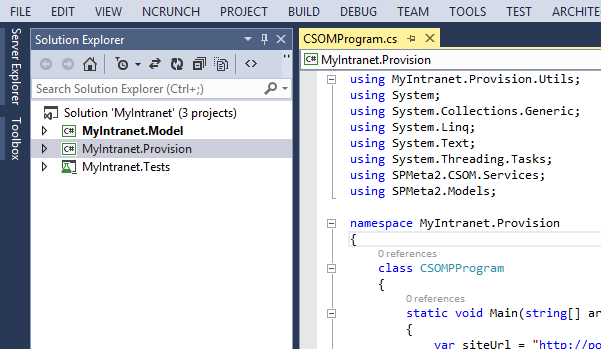
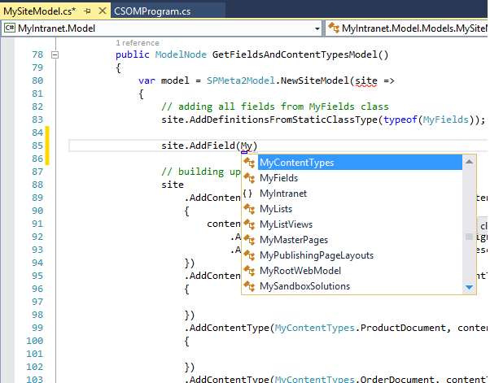
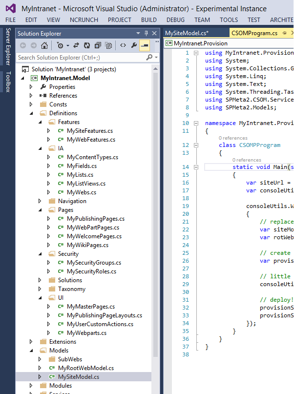
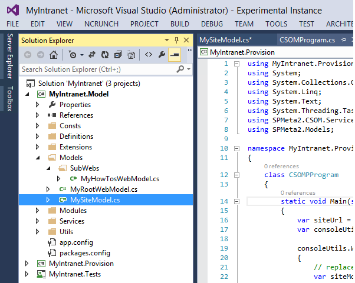
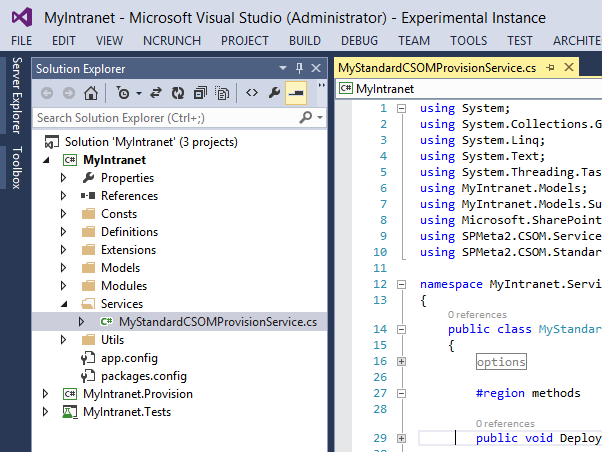

---
Title: Getting started
Order: 200
TileLink: true
TileLinkOrder: 20
---

## Getting started with M2 VS Extensions
The current document contains general concepts, guidelines and recommendation on building SharePoint solutions with the SPMeta2 library. It is crafted based on both SPMeta Dev team experience on building M2 library, supporting companies all over the world and client's feedback as such. Hence, it should be considered not only as a jump start guide but also as a production ready approach on building M2 solutions. 

The target audience is .NET developers, team leads and software architects who are familiar with POCOs, fluent API, DSL, CI/ALM and seeking guides on he following areas:
* Introduction to SPMeta2 library
* Naming convention on SPMeta2 projects
* Projects, folders structure and its purpose
* Craftinf definitions
* Crafting model
* Crafting provision servives

Altogether the document provides a high-level overview of building highly scalable, repeatable and easy-to-maintain projects on top of SPMeta2 library for SharePoint 2013 and O365 using both CSOM/SSOM.

### SPMeta2 library introduction
[SPMeta2]("https://github.com/SubPointSolutions/spmeta2") (later referenced as M2)  is a .NET library that offers a hassle-free fluent API supporting not only SharePoint 2010, 2013 and O365, but also CSOM and SSOM. The library provides a set of c# objects to define SharePoint artifacts, a fluent API to compose these artifacts into models, and then a supercharged, well-designed and tested CSOM/SSOM provision API to deploy these models to SharePoint.

Before continue, please get familiar with the following in-depth overview of SPMeta2 library. It provides more context around how it works, what are the definitions, models, and provision services.

* [Welcome to SPMeta2](/spmeta2/)
* [M2 Basics - how it works](/spmeta2/basics/)
* [A console application how-to](/spmeta2/basics/getting-started/)

Once done, consider skimming the following provision scenario list, so that you'd get some ideas on how M2 approaches defining artists and composing them into a model:

* [100+ scenarios and samples](/spmeta2/scenarios/)

At the end of this section you should be familiar with the following M2 concepts - definitions, models, and provision services, so that the next building block - Visual Studio templates - would be easy to follow.

### Naming convention on SPMeta2 projects
M2 projects tend to follow a specific naming convention on file names, classes, folder names and folder structure. That introduces consistency, clean and well-design approach across projects and teams. Most of the things are pre-generated by the Visual Studio project templates, so there is no need to follow them manually.

#### Solution-wide naming
Ultimately, M2 based solution might have several projects as following
* **MyIntranet.Model** - a .NET library with POCOs - definitions and models
* **MyIntranet.Provision** - a console application, provider hosted app, farm package *.wsp or PowerShell 
* **MyIntranet.Tests** - a unit-test project

Here is how it might look like for a 'MyIntranet' project:

**MyIntranet.Model** project is supposed to be a pure .NET library containing M2 POCOs - definitions and models without dependencies on SharePoint CSOM or SSOM runtime. Having build you model that way, you eliminate dependency on SharePoint runtime so that you can provision the model via CSOM under console application, remote event receiver, SharePoint app or add-in as well as via SSOM under *.wsp package and its feature, PowerShell, console app or anything else. It might be a case for ISVs who build intranets for both SharePoint 2010, 2013 and O365 and who interested to share the codebase across project within limiting it to a specific SharePoint runtime such CSOM or SSOM.

Having said that, for smaller projects it might be unreasonable and overengineered to follow that separation so that you might have dependency on CSOM/SSOM or even bothg runtimes within your model project.

**MyIntranet.Provision** totally depends on the nature of your project. It might be a console app, a SharePoint provider hosted app, a PowerShell script or even an old-plain *.wsp farm solution. The main purpose of the project is to provision M2 model from **MyIntranet.Model** project to SharePoint. Would it be CSOM or SSOM, that's up to you.

**MyIntranet.Tests** is used not only for classic unit-tests, but also to start a provision in the background while you are working on something else. Consider adding the following test methods, so that you can run particular bits if your provision in the background, as a unit-test while continue working on something else.
* Can_Provision_Intranet()
* Can_Provision_Intranet_Site()
* Can_Provision_Intranet_RootWeb()

### Project-wide naming
Using [SPMeta2 Extensions for Visual Studio]("https://github.com/SubPointSolutions/spmeta2-vsixextensions"), you can create a new **MyIntranet.Model** project just in a few click. Here is how it might look like for a 'MyIntranet' project:

The actual creation process is documented here, so let's focus on the folder structure, naming convention and purpose.

#### Folders
**MyIntranet.Model** project has the following folders structure:

* /Consts - contains 'project constants' classes
* /Definitions - contains M2 definition classes grouped by subfolders / speficic
* /Extensions - houses 'project specific' extension methods 
* /Models - contains M2 site, root web and web models
* /Modules and /Modules/Explicit - stores assets to be deployed to SharePoint, img/css/html/etc
* /Services - stores provisioning services, either CSOM/SSOM, or both
* /Utils - any kind of 'project specific' usullitis go here

The development flow goes as following:
* Adding new definitions to the /Definition folder/files
* Adding new models to the /Models folders/files, updating the models
* Updating provision services in the /Services folder

Altogether that simplifies the development flow and daily routines as all M2 model projects are build and structure in the same ways.

#### Project specific prefix
All generated classes have a 'project' specific prefix such as "Intr" by default. You can change that while creating a new project with the wizard.

The idea is that "S" can stand for "SimpleIntranet" project you are working on, or "Dm" can stand for "Document Management" system you are working on. Once you have "S" or "Dm" prefix for some classed, it becomes extremely easy and enjoyable to look up a needed class with the Visual Studio IntelliSense. Just type "S" or type "Dm" and enjoy the result. For 'MyIntranet' the prefix might be 'My', so that's what we see once type 'My':

For instance, we are interested in all webs have in the solution, so we type "SWebs" or "DmWebs". The content types would be 'SContentTypes' or "DmContentTypes" and the fields would go as "SFields" and "DmFields". Too easy, so why don't so that?

By default, it can be suggested to label the following classes with the 'project' specific prefix:
* all definitions under /Definition folder
* all services under /Services folder
* all consts under /Consts folder
* all utils undet /Utils folder

### Crafting definitions
There is a folder /Definitions which houses all M2 related definitions - fields, content types, webs and so on.
As there might be lots of definitions, we tend to group them by sub-folders so that they be easy to lookup and maintain later. 

The following folders are used:

* /Features - stores site and web features
* /IA - stands for information architecture, houses fields, content types, lists, list views and webs
* /Navigation - top and quick (left) navigation, plus web navigation settings on webs
* /Pages - wiki, web part and publishing pages, plus welcome pages (landing pages)
* /Security - stores security groups and roles
* /Solutions - for sandbox / farm solutions
* /Taxonomy - term store, term group, term set and terms
* /UI - all that has its representation, master pages, publishing layouts, web part, user custom actions

That's how it looks like in the 'MyIntranet' project:

Depending on your project, there might be a need to introduce new definitions, such as farm solutions or farm features or something else, so consider to reasonable follow pre-generated folder structure and create reasonable names new folders.

Additional links:
* [M2 Basics](/spmeta2/basics/)
* [M2 Definitions](/spmeta2/definitions/)
* [SharePoint Foundation Definitions](/spmeta2/definitions/sharepoint-foundation/)
* [SharePoint Standard Definitions](/spmeta2/definitions/sharepoint-standard/)

### Crafting models
There is a folder /Models which stores site and web models.

We tend to split models into several smaller classes dividing them by SharePoint 'scope' - site level, root web level, home web, and then set of the 'specific' webs. There are at least two models which are pre-generated for every project:

* Site model, contains site level artifacts
* RootWebModel, contains root web level artifact

That's how it looks like in the 'MyIntranet' project:

If project has a set of subsites, then every sub site should have a dedicated web model. Such models go to /SubWebs folder. Tend to have a self-contained site or web models, so that they can be deployed independently - pnly site, only web, only sub web model. 

Additional links:
* [M2 Basics](/spmeta2/basics/)
* [M2 Definitions](/spmeta2/definitions/)
* [M2 Models](/spmeta2/models/)

### Crafting services
Every project should have at least one 'XXXProvisionService' - a class responsible for the whole provision.

[SPMeta2 Extensions for Visual Studio]("https://github.com/SubPointSolutions/spmeta2-vsixextensions"), allows to create a model project with 'no provision, POCOs only' options, so that no provision services and SharePoint dependencies is introduced. In that case, a provision service should live in the other assembly.

In case if you embed provision service in the model project, there is a 'XXXProvisionService' generated under /Service folders. It has a full set of methods allowing to either deploy everything, to deploy a bit of the model - only site model, only root web model and so on.

Generated 'MyIntranet' provision with snatdard and CSOM provision will look as follow:

Depending on your project, you might be interested in configuring provision from the UI, from the app.config, from the console input and so on. All options work well.