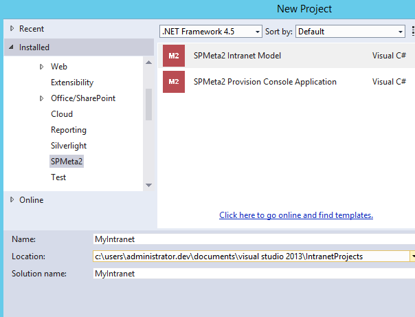

## Getting started with M2 VS Intranet Model project
The current document describes general concepts, guidelines and recommendation on building SharePoint solutions with the SPMeta2 library. It is crafted based on both SPMeta Dev team experience on building M2 library, supporting companies all over the world and client's feedback as such. Hence, it should be considered not only as a jump start guide but also as a production ready approach on building M2 solutions.

The target audience is .NET developers, team leads and software architects who are familiar with POCOs, fluent API, DSL, CI/ALM and seeking guides on he following areas:

* Overview of SPMeta2 project templates
* SPMeta2 Intranet Model project template
* SPMeta2 Provision Console project template
* Snippets

Altogether the document provides a high-level overview of building highly scalable, repeatable and easy-to-maintain projects on top of SPMeta2 library for SharePoint 2013 and O365 using both CSOM/SSOM.

Before continue, please get familiar with the following [General concepts](https://github.com/SubPointSolutions/spmeta2-vsixextensions/wiki/General-concepts), so that it would be much easier to get into the project template details.

### Overview of SPMeta2 project templates
Visual Studio project templates provide a consistent and reusable way to bootstrap projects and its structure in a few click away. 

[SPMeta2 Extensions for Visual Studio]("https://github.com/SubPointSolutions/spmeta2-vsixextensions") contains a few pre-defined project templates for 'Intranet Model' and 'Console Provision' project creation. That simplifies initial project setup, creates recommended folder structure, initial files and classes as per the suggestions in the [General concepts](https://github.com/SubPointSolutions/spmeta2-vsixextensions/wiki/General-concepts) document.



In nutshell, here is a general idea of the project separation and responsibilities:
* 'Intranet Model' - contains 'WHAT TO PROVISION STUFF' - SharePoint artifacts' 
* 'Console App Provision' - contains 'HOW TO PROVISION' - with CSOM/SSOM or somehow else

### SPMeta2 Intranet Model project template
This template bootstraps a new .NET library with predefined folder structure, files and classed described in [General concepts](https://github.com/SubPointSolutions/spmeta2-vsixextensions/wiki/General-concepts) document. The project houses the following artifacts and responsibilities:
* Definitions  - simple saying, SharePoint artifact such as fields, content types, etc...
* Models - same artifact that are grouped together into local pieces, models


Depending on the case, you might keep that project a pure .NET library with SPMeta2 POCO classes only, so that you can reuse it later within CSOM or SSOM based provision, or you might include a provision logic (ProvisionService) inside that project, so that you will have a dependency on a specific SharePoint runtime.

Once creating a project based on this template, you will be required to provide a project name and location, and then you will be asked to provide project specific settings as per the following screen:


Here are mode details on the settings:

|Parameter Name  	|  Sample value	|  Description |
|-------------	|-------------	|-------------	|
|Project prefix  	|   'MyInt'	| That value will be used as a prefix for some files and classed during the project generation. Please refer to [General concepts](https://github.com/SubPointSolutions/spmeta2-vsixextensions/wiki/General-concepts) for mode details.|
|Site fields group | _MyIntantet | That value will be used as a 'Group' property for all fields. Can be changed later.|
|Content types group | _MyIntantet | That value will be used as a 'Group' property for all content types. Can be changed later.|
|Target platform edition | as per choices | That options suggests which NuGet packages and assemblies to add to your projects. Foundation won't add 'SPMeta2.Standard' packages and will skip all additional SharePoint assemblies. Most of the case you have at least SharePoint Standard / O365, so go with 'Standard'|
|Target provision runtime | as per choices  |  use 'POCOs only' options if you want to eliminate SharePoint runtime dependency, overwise pick the right one for you|

Once set up, the project will have the following folder structure. Details on that can be found in [General concepts](https://github.com/SubPointSolutions/spmeta2-vsixextensions/wiki/General-concepts).

The pre-generated project has a bunch of the artifacts defined plus two models - site model and root web model. Once you setup and hit deploy, that's what is going to be provisioned for you by default at site ad root web levels:'

##### Site level, MySiteModel
* Enabling site feature 'BasicWebParts' from MySiteFeatures
* Adding User Custom Action to deploy jQuery from MyUserCustomActions
* Adding User Custom Action to deploy custom js script from MyUserCustomActions
* Adding 2 (all) security group from MySecurityGroups
* Adding 2 (all) security roles defined in MySecurityRoles
* Adding 10 (all) site fields form MyFields
* Adding 6 content types from MyContentTypes, with linking to the fields

##### Root web level, MyRootWebModel
* Disabiling 'MDS' web feature
* Enabling 'Team Collabration Lists' web feature
* Enabling 'Wiki Page Home' web feature
* Adding 4 top navigatino nodes
* Adding 6 quick navigation nodes
* Adding document libraries
    * Company Documents
    * Orders
* Adding lists
    * Services
    * Sales Tasks (task list with hierarhy)
    * Sales Events (calendar list)
* Adding various content types to the mentioned early lists
* Adding various list views to the mentioned lists
* Setting up default content type in the mentioned lists
* Adding two web part pages to the 'Site Pages' library
    * Landing Page
    * About This Site page
* Adding XsltListView, ListView, ContentEditor web parts to 'Landing Page' page
* Adding ContentEditor web parts to 'About This Site' page
* Setting up 'Landing Page' as a welcome, default landing page of the web
* Uploading all content from /Modules/Implicit/Style Library to SharePoint's Style Library

All these artifacts are defined in multiple classes under /Definitions folders and then put together within MySiteModel and MyRootWebModel under /Models folders.

At this stage we setup a nice and fully repeatable intranet project showing up a very basics of the SPMeta2 library, definitions, and models. 

#### Provision
**If you set a particular SharePoint provision runtime** while creating the projects, then you will have a pre-generated provision class under /Service folder. It has two methods to provision either 'everything' or just 'some bits' of the whole model as following:

```cs
public void DeployIntranet(ClientContext context)
public void DeployIntranet(ClientContext context, Options options)
```

To get things provisioned, create a new console application or unit test, create a new ClientContents (or SPSite) object and then pass it to DeployIntranet(ClientContext context) methods. That's CSOM based provision, in case you selected SSOM, you will have SPSite object as a parameter for DeployIntranet() method. Have a look, dig into the source code.

**If you have not set a SharePoint provision runtime** and went with the plain POCOs, then create a new console application or unit test, create a new ClientContents (or SPSite) object and then use the following snippet as a jump-started:

```cs
// create correct provision service
// SharePoint Foundation: CSOMProvisionService / SSOMProvisionService
// SharePoint Standard: StandardCSOMProvisionService / StandardSSOMProvisionService
var provisionService = new CSOMProvisionService(); 

// create models
var siteModel = new IntrSiteModel();
var rootWebModel = new IntrRootWebModel();

// .. get the SharePoint context here, as context

// site model
provisionService.DeploySiteModel(context, siteModel.GetSiteFeaturesModel());
provisionService.DeploySiteModel(context, siteModel.GetUserCustomActionModel());
provisionService.DeploySiteModel(context, siteModel.GetSiteSecurityModel());

provisionService.DeploySiteModel(context, siteModel.GetFieldsAndContentTypesModel());
provisionService.DeploySiteModel(context, siteModel.GetSandboxSolutionsModel());

// root web model
provisionService.DeployWebModel(context, rootWebModel.GetStyleLibraryModel());
provisionService.DeployWebModel(context, rootWebModel.GetModel());

```

Use the following services as per correct SharePoint edition:
* SharePoint Foundation: CSOMProvisionService / SSOMProvisionService
* SharePoint Standard: StandardCSOMProvisionService / StandardSSOMProvisionService

Once all setup, here is a your first, fantastic, ready-to-use SharePoint Intranet build on top of SPMeta2. Enjoy!

